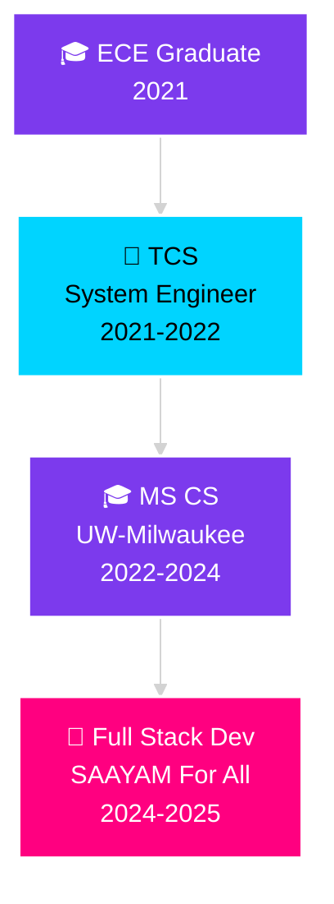

<div align="center">


<br/>

<a href="https://www.linkedin.com/in/shreyaadla">
  
</a>
<a href="mailto:shreyaadla12@gmail.com">
  
</a>
<a href="https://github.com/ShreyaAdla">
  
</a>
<a href="YOUR_PORTFOLIO_URL">
  
</a>

<br/><br/>


</div>

<br/>

<div align="center">

## 🌟 WHO AM I? 🌟

</div>

<table align="center">
<tr>
<td width="50%" valign="top">

### 👤 PERSONAL STACK

```yaml
Name: Shreya Adla
Location: Milwaukee, WI 🌆
Role: Full Stack Developer
Company: Capital One
Education: MS Computer Science

Mission: |
  "Transform complex problems into 
   elegant, scalable solutions"

Current_Quest: 
  - Building cloud-native applications
  - Mastering Kubernetes orchestration
  - Optimizing CI/CD pipelines
  
Fun_Fact: |
  Debugging production at 3 AM is my
  version of an adrenaline rush ⚡
```

</td>
<td width="50%" valign="top">

### 💼 PROFESSIONAL JOURNEY



### 🎯 CORE STRENGTHS

🔹 **Problem Solver** → Complex systems simplified  
🔹 **Cloud Architect** → AWS & Azure expertise  
🔹 **Team Player** → Agile collaboration master  
🔹 **Fast Learner** → Always evolving  

</td>
</tr>
</table>

<br/>

<div align="center">

## ⚡ TECH ARSENAL ⚡

</div>

<div align="center">

### 💻 Languages & Frameworks

<table>
<tr>
<td align="center" width="96">

<br>Java
</td>
<td align="center" width="96">

<br>Spring Boot
</td>
<td align="center" width="96">

<br>Python
</td>
<td align="center" width="96">

<br>React
</td>
<td align="center" width="96">

<br>JavaScript
</td>
<td align="center" width="96">

<br>C++
</td>
<td align="center" width="96">

<br>HTML5
</td>
<td align="center" width="96">

<br>CSS3
</td>
</tr>
</table>

### ☁️ Cloud & DevOps

<table>
<tr>
<td align="center" width="96">

<br>AWS
</td>
<td align="center" width="96">

<br>Azure
</td>
<td align="center" width="96">

<br>Docker
</td>
<td align="center" width="96">

<br>Kubernetes
</td>
<td align="center" width="96">

<br>Jenkins
</td>
<td align="center" width="96">

<br>Terraform
</td>
<td align="center" width="96">

<br>Prometheus
</td>
<td align="center" width="96">

<br>Grafana
</td>
</tr>
</table>

### 🛠️ Tools & Platforms

<table>
<tr>
<td align="center" width="96">

<br>Git
</td>
<td align="center" width="96">

<br>GitHub
</td>
<td align="center" width="96">

<br>VS Code
</td>
<td align="center" width="96">

<br>Linux
</td>
<td align="center" width="96">

<br>MySQL
</td>
<td align="center" width="96">

<br>MongoDB
</td>
<td align="center" width="96">

<br>Postman
</td>
<td align="center" width="96">

<br>Figma
</td>
</tr>
</table>

</div>

<br/>

<div align="center">

## 🎯 WHAT I DO BEST

</div>

<table>
<tr>
<td width="25%" align="center">

### 🏗️
### **Architecture**

Design scalable  
microservices with  
Spring Boot

Build RESTful APIs  
for seamless  
integration

</td>
<td width="25%" align="center">

### ☁️
### **Cloud Native**

Deploy on AWS  
& Azure platforms

Orchestrate with  
Kubernetes

IaC with Terraform

</td>
<td width="25%" align="center">

### 🔄
### **DevOps**

Automate CI/CD  
pipelines

Monitor with  
Prometheus &  
Grafana

Container magic  
with Docker

</td>
<td width="25%" align="center">

### 🎨
### **Full Stack**

React.js frontends

Java backends

End-to-end  
feature delivery

</td>
</tr>
</table>

<br/>

<div align="center">

## 🚀 FEATURED INNOVATIONS

</div>

<table>
<tr>
<td width="50%">

<div align="center">

### 🌱 IoT Moisture Monitor
**Smart Agriculture Solution**


</div>

```python
Features:
├── 📊 Real-time soil moisture tracking
├── 💧 Automated irrigation triggers
├── 🌐 Cloud data logging
└── 📱 Mobile notifications

Impact:
• Optimized water usage by 40%
• Prevented plant stress
• Sustainable farming tech
```

**Tech Stack:** Sensors • Arduino • IoT Cloud • Python

</td>
<td width="50%">

<div align="center">

### ❤️ Heart Attack Detection
**Life-Saving Healthcare IoT**


</div>

```python
Features:
├── 💓 Real-time heart rate monitoring
├── 🚨 Irregular pattern detection
├── 📞 Emergency alert system
└── 📈 Historical data analysis

Impact:
• Early warning system
• Potentially life-saving
• Accessible healthcare tech
```

**Tech Stack:** Sensors • Machine Learning • Cloud • Alerts

</td>
</tr>
<tr>
<td width="50%">

<div align="center">

### 🤖 Pick & Place Robot
**Industrial Automation**


</div>

```python
Features:
├── 🎯 Precision object placement
├── 📱 Android control interface
├── ⚙️ Programmable workflows
└── 🏭 Manufacturing integration

Achievement:
• Internship @ ECIL
• Automated production line
• Improved efficiency by 35%
```

**Tech Stack:** Electro-Mechanical • Android • Embedded Systems

</td>
<td width="50%">

<div align="center">

### 🌐 Microservices Platform
**Enterprise Scale Application**


</div>

```python
Features:
├── 🔧 RESTful API architecture
├── 🐳 Containerized deployment
├── 📊 Monitoring & logging
└── 🔄 CI/CD automation

Current Work:
• @ SAAYAM For All
• Serving 1000+ users
• 99.9% uptime
```

**Tech Stack:** Spring Boot • Docker • Kubernetes • Jenkins

</td>
</tr>
</table>

<br/>

<div align="center">

## 📊 GITHUB ANALYTICS

</div>

<div align="center">

<table>
<tr>
<td width="50%">


</td>
<td width="50%">


</td>
</tr>
</table>


<br/><br/>


</div>

<br/>

<div align="center">

## 🏆 CERTIFICATIONS & ACHIEVEMENTS

</div>

<table>
<tr>
<td width="33%" align="center">


### Azure Fundamentals

✅ **Certified**

*Cloud platform expertise*

</td>
<td width="33%" align="center">


### Python Development

✅ **Completed** (Udemy)

*Advanced programming skills*

</td>
<td width="33%" align="center">


### Machine Learning

✅ **Completed**

*ML with Python*

</td>
</tr>
<tr>
<td width="33%" align="center">


### AI For Everyone

✅ **Completed** (Coursera)

*AI fundamentals & applications*

</td>
<td width="33%" align="center">


### Web Development

✅ **Completed** (Coursera)

*JS, HTML & CSS Foundations*

</td>
<td width="33%" align="center">


### Cloud Practitioner

🔄 **In Progress**

*AWS certification journey*

</td>
</tr>
</table>

<br/>

<div align="center">

## 💭 MY CODE PHILOSOPHY

</div>

<table>
<tr>
<td width="60%">

```typescript
interface DeveloperMindset {
    principles: {
        cleanCode: "Self-documenting and maintainable",
        scalability: "Build for tomorrow's scale",
        security: "Security-first architecture",
        testing: "Test-driven development",
        collaboration: "Great software = teamwork"
    };
    
    dailyRoutine(): string[] {
        return [
            "☕ Fuel up with coffee",
            "💻 Write elegant code",
            "🔍 Review and refactor",
            "🐛 Hunt down bugs",
            "🚀 Deploy with confidence",
            "📚 Learn something new",
            "🔁 Repeat tomorrow"
        ];
    }
    
    motto: "Code is poetry, bugs are just plot twists 🎭"
}
```

</td>
<td width="40%">

<br/>

> ### 🎯 Core Values
> 
> **💡 Innovation First**  
> Push boundaries, explore new tech
> 
> **🛡️ Quality Matters**  
> No shortcuts, no compromises
> 
> **🤝 Team Success**  
> Individual wins < Team wins
> 
> **📈 Continuous Growth**  
> Yesterday's best < Today's better
> 
> **🌍 Impact Driven**  
> Code that makes a difference

<br/>

</td>
</tr>
</table>

<div align="center">

### 🎭 "The best code is no code. The second best is elegant code."

</div>

<br/>

<div align="center">

## 🤝 LET'S BUILD SOMETHING AMAZING TOGETHER

### Open to Collaborations | New Opportunities | Tech Discussions

<br/>

### ⚡ *"First, solve the problem. Then, write the code."* ⚡

<br/>

---


**Made with 💜**

</div>
